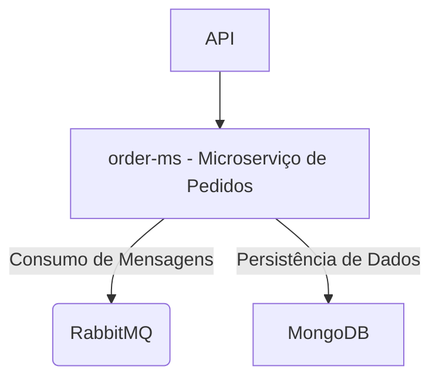

# OrderMs API

Este projeto tem como objetivo criar uma API para processar pedidos consumidos de uma fila RabbitMQ e realizar a modelagem de banco de dados necessária para registrar as informações dos pedidos. A API fornece funcionalidades como consultar o valor total de um pedido, a quantidade de pedidos por cliente e a lista de pedidos realizados por cada cliente.

### Tecnologias Utilizadas
- **Java 21** com **Spring Boot**
- **MongoDB** para persistência de dados
- **RabbitMQ** para processamento assíncrono de pedidos

### Funcionalidades
1. **Processar pedidos da fila RabbitMQ**  
   Consumo de mensagens da fila `btg-pactual-order-created` para registrar pedidos no banco de dados.
   
2. **Endpoints RESTful**
   - Obter valor total de um pedido
   - Consultar a quantidade de pedidos por cliente
   - Listar todos os pedidos realizados por cliente

### Exemplo de Mensagem na Fila

```json
{
  "codigoPedido": 1001,
  "codigoCliente": 1,
  "itens": [
    {
      "produto": "lápis",
      "quantidade": 100,
      "preco": 1.10
    },
    {
      "produto": "caderno",
      "quantidade": 10,
      "preco": 1.00
    }
  ]
}
```
## Requisitos da API

A API deverá expor as seguintes funcionalidades:

- **Valor total de um pedido**: Soma do valor de todos os itens do pedido.
- **Quantidade de pedidos por cliente**: Total de pedidos feitos por cada cliente.
- **Lista de pedidos realizados por cliente**: Detalhamento dos pedidos feitos por cada cliente.


## Modelagem de Dados

### Diagrama ER



## Como Executar o Projeto

### Pré-requisitos
- **Java 21**
- **MongoDB**
- **RabbitMQ**
- **Maven**

### Passos para Executar

1. Clone este repositório:
  
   git clone https://github.com/pblda13/OrderMs.git
  
2. Configure as variáveis de ambiente para o MongoDB e RabbitMQ, caso necessário.

3. Execute o projeto com Maven:


## Melhorias Futuras
- Implementar autenticação e autorização.
- Adicionar monitoramento e métricas de desempenho.

## Contribuições
Sinta-se à vontade para fazer um fork deste repositório e propor melhorias.


